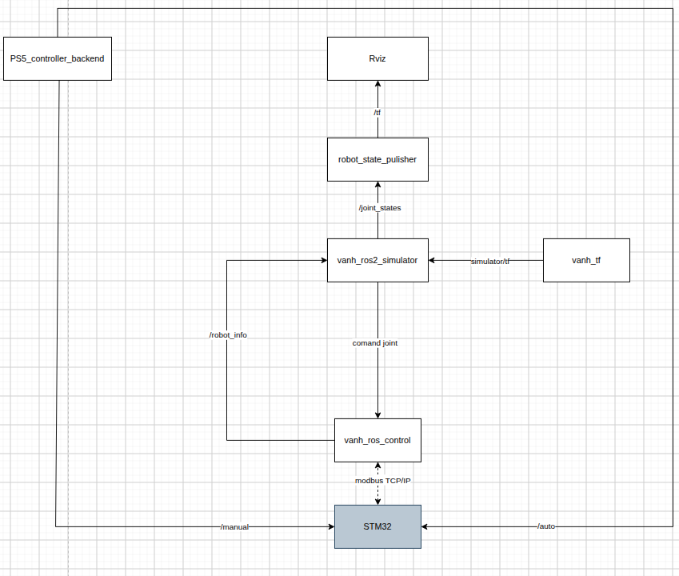

# Roadmap — vanh quadruped

Architecture reference: Nishio project (`~/Documents/Nishio/ros/`). Some gait/IK algorithms will be referenced from `Orion-Quadruped-master` (`~/Documents/Orion-Quadruped-master/`). Update this file directly as work progresses — tick `[x]` when done, note date/decision if direction changes.

Convention:
- `[ ]` not started — `[~]` in progress — `[x]` done

---

## 1. vanh_ros_simulator
Role: main brain — URDF/ros2_control, MoveIt, trajectory execution. Equivalent to `nishio_ros2_moveit2`, used for planning/preview only, does not directly drive real hardware. Package name on disk: `vanh_ros_simulator` (already exists as an empty skeleton in `src/`).

**First concrete step (locked 2026-09-25):** subscribe `/robot_info` (published by `vanh_ros_control`), map its 12 feedback angles to the correct URDF joint names, republish as `sensor_msgs/JointState` on `/joint_states` for `robot_state_publisher` → RViz. When this node runs, `joint_state_publisher`/`joint_state_publisher_gui` in `view_model.launch.py` must be disabled — only one publisher on `/joint_states` at a time.

- [~] `/robot_info` → `/joint_states` bridge node (see design below)
- [ ] Confirm ROS 2 distro (Humble/Jazzy) before writing code
- [ ] Add `<ros2_control>` block to xacro (12 joints, `command_interface position`, `state_interface position`)
- [ ] Use `mock_components/GenericSystem` as the hardware plugin for now (not real hardware)
- [ ] Write `controllers.yaml`: `joint_trajectory_controller` + `joint_state_broadcaster`
- [ ] Launch `controller_manager`, verify with `ros2 control list_controllers` / `list_hardware_interfaces`
- [ ] Test sending a trajectory manually (action client or `ros2 topic pub`) before wiring up MoveIt
- [ ] Integrate MoveIt: SRDF, kinematics.yaml, planning pipeline (reference Nishio's `config_v3/`)
- [ ] Write a dedicated trajectory-execute node if MoveIt's default execution pipeline isn't flexible enough for high-frequency gait (reference `nishio_trajectory_execute_node.cpp`)
- [ ] (Optional) Gazebo for real physics when balance/foot-contact needs checking

## 2. vanh_ros_control
Role: hardware/sim communication — does NOT use ros2_control. Plain rclpy/rclcpp node, picks one of two interfaces sharing the same API via a `simulation` param. Equivalent to `nishio_ros_control`.

**`/robot_info` schema (locked 2026-09-25):** dedicated message, feedback only (never carries commanded angles — commands are a separate topic/service, added later alongside PS5 manual/auto mode). Fields: `header`/timestamp + 12 joint angles in **rad**. `vanh_ros_control` is the only publisher, in both Sim and STM32 mode — RViz must see the same real feedback path regardless of mode. Bootstrap/test plan: manually publish a sample `/robot_info` message before PS5 or STM32 exist, to validate the bridge in `vanh_ros_simulator` end to end.

- [~] Define `/robot_info` message (header + 12x float64 positions, rad, feedback-only) — equivalent to Nishio's `RobotInformation`
- [ ] Define command message/service for manual/auto mode later — equivalent to Nishio's `AutoControl`/`ManualControl` (deferred, not blocking `/joint_states`)
- [ ] `Sim_Interface`: numeric joint simulation (angle limits, interpolated speed) — no physics engine needed, runnable right away
- [ ] Main node: publish `/robot_info` on a timer, pick interface (Sim/STM32) via `simulation` param
- [ ] `Uart_Interface`: write the skeleton first (same method signature as Sim_Interface), no need to run against real hardware yet
- [ ] Define the UART protocol with STM32 (in parallel with the step below — framing/checksum must be agreed before coding both sides)

## 3. vanh_stm32
Role: firmware controlling the 12 joints. Only starts once real hardware exists.

- [ ] Leave as an empty skeleton for now, not implemented
- [ ] Once hardware exists: implement the UART protocol agreed on in `vanh_ros_control`
- [ ] Read encoder/feedback joint angles, return them at a fixed cycle
- [ ] Receive angle setpoints, drive motors (PID or existing driver depending on motor type)

## 4. vanh_working_planner
Role: process point cloud data from the 2D lidar, feeding foot placement / obstacle avoidance. Equivalent to `nishio_working_planner` but simpler since input is 2D. Orion's Jetson workspace has a similar split worth checking (`Software/Jetson/workspace/isaac_ros-dev/src/orion_lidar`, `orion_navigation`, `orion_msgs`).

- [ ] Nail down the concrete goal: obstacle avoidance while walking, terrain-aware foot placement via local map, or both
- [ ] Loader for 2D lidar data (`sensor_msgs/LaserScan` or `PointCloud2` depending on the lidar driver)
- [ ] Basic processing logic (noise filtering, obstacle clustering)
- [ ] Output: decide the data format the gait planner consumes (must be agreed before coding both sides)

## 5. vanh_tf
Role: adapter — looks up standard tf2 transforms and republishes them in the format/units other nodes need (not a replacement for tf2). Equivalent to `nishio_tf`.

- [ ] Defer until it's clear which node needs a foot pose without wanting to do its own tf2 lookup (gait planner? control node?)
- [ ] If needed: determine source/target frames (base_link → each foot link), output units, publish rate

---

## Gait / IK (referencing Orion-Quadruped-master)

Orion has two IK/gait implementations worth comparing before picking one:
- `Software/STM32Firmware/Orion-Controls/src/LegIK.cpp` + `main.cpp` — per-leg analytic IK (hip/femur/tibia, law-of-cosines solve), gait functions (`stepGait`, `sineStepGait`, `unisonGait`) run directly on the STM32, no ROS involved.
- `Software/kinematics_sim/matplotlib_simple_sim/kinematics.py` — matrix-based IK per leg with body rotation + center-of-rotation offset support (adapted from an external IK reference), meant for simulation/prototyping in Python, not firmware.

Open decision — where should gait/IK live in the vanh stack:
- [ ] Option A: analytic IK on `vanh_stm32` (like Orion) — lowest latency, but ROS side only sends foot targets, harder to unit-test/visualize
- [ ] Option B: IK/gait in `vanh_ros_simulator` or `vanh_ros_control` (like Nishio's split) — easier to test/visualize in RViz, STM32 just executes joint angles
- [ ] Decide before starting `vanh_stm32` protocol design, since it determines whether UART carries joint angles or foot (x,y,z) targets
- [ ] Once decided: port/adapt the relevant IK math (reference file above) into the chosen package

---

## Suggested order

1. `vanh_ros_control` with `Sim_Interface` — runnable immediately, no hardware dependency
2. `vanh_ros_simulator` with `mock_components/GenericSystem` — verify the 12 joints via MoveIt/RViz
3. Basic gait/IK, referencing Orion-Quadruped-master
4. `vanh_working_planner` once real or simulated lidar data is available
5. `vanh_tf` once a concrete need arises
6. `vanh_stm32` + `Uart_Interface` once hardware exists
