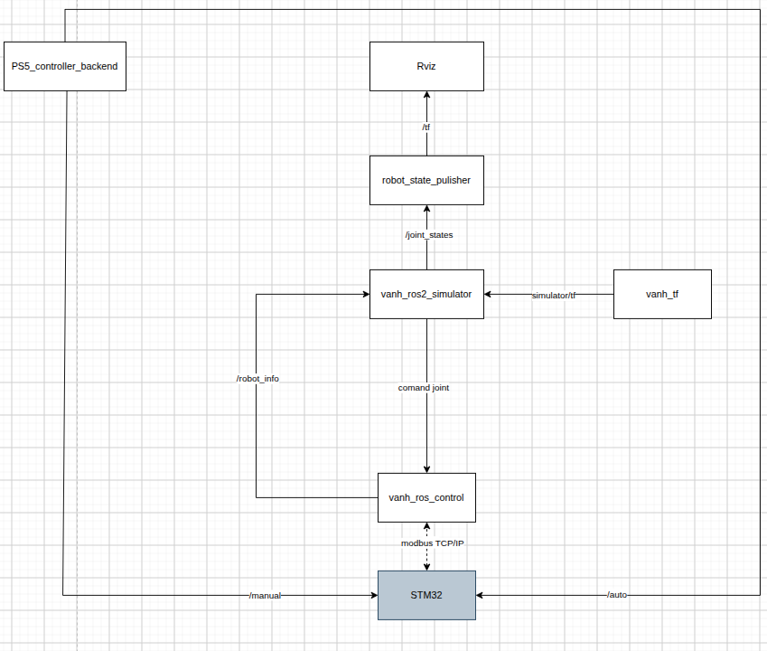

# Roadmap — vanh quadruped

Architecture reference: Nishio project (`~/Documents/Nishio/ros/`). Some gait/IK algorithms will be referenced from `Orion-Quadruped-master` (`~/Documents/Orion-Quadruped-master/`). Update this file directly as work progresses — tick `[x]` when done, note date/decision if direction changes.

Convention:
- `[ ]` not started — `[~]` in progress — `[x]` done

---

## Current status (updated 2026-09-30)

**Done:** `vanh_msgs` (`JointState`, `RobotInformation`, `Stm32Status`, `ManualControl`, `ChangeMode.srv`); `vanh_ros_control` (`Sim_Interface` + `ros_control_node`, publishes `/robot_info`, accepts `/joint_command`); `vanh_ros_simulator` bridge `/robot_info` → `/joint_states` (Nishio-style cached state + `publishJointState` thread, named index mapping `ROBOT_JOINT_ORDERS` ↔ `ManualControl` joint constants, joint names in `param/config.yaml`), two launch files (`ros_control.launch.py`, `simulator.launch.py`, run in separate terminals like Nishio). URDF switched to `robot_reinforcement.urdf` (root `trunk`, joints `FL_hip_joint`...).

**Decisions 2026-09-30 for gait + IK:**
- **Canonical URDF = `robot_reinforcement.urdf`.** It has foot links (`*_foot`, so FK can be checked against TF), a clean zero pose (thigh horizontal pointing back, calf vertical) identical on all four legs, and `ROBOT_LIMIT` was taken from it. `robot_description.urdf` has no foot link and left/right thigh zero offsets of 27.7° / 33.4°, so IK derived for one file does not fit the other.
- **Leg geometry equals Orion's firmware:** L1 hip offset 0.0393 m (`L1_HIP` 39.3 mm), L2 thigh 0.1095 m (`L2_FEMUR` 109.5), L3 calf-to-foot 0.1198 m (`L3_TIBIA` 119.9). Orion's analytic IK applies after converting units (mm → m, Orion z points down) and URDF sign conventions (hip axis −x on front legs / +x on rear; thigh/calf axes mirrored left/right). Orion's Python `kinematics.py` uses *different* sizes (45 / 111.5 / 155 mm) — do not take numbers from it.
- **Language/location: Python, new `ament_python` package `vanh_gait`** (Nishio keeps IK in Python in `nishio_python_ultis`). Math is easier to write and unit-test with numpy + pytest, and joint limits can be read from the same URDF instead of being copied into a second language.
- **Geometry and limits are read from the URDF at runtime**, not typed in by hand — one source of truth, no transcription errors, tiny `rpy` terms included in FK.
- **IK is a library function, not a service.** 4 legs × 20–50 Hz; Nishio's `solve_ik` service works because it is called once per waypoint, not per control tick.
- **Gait runs on a timer with a phase variable, not blocking loops** — same as Orion's real firmware (`calculateTrotGaitPositions`), unlike the Arduino prototype's blocking `stepGait()`.
- **IK output must be checked against the joint limits before publishing** — `controlManualJoint` rejects the whole 12-joint command if any angle is out of range. On IK failure keep the last valid command and warn; never publish a mix of new and old angles.
- **Do not snap to home when stopping.** Orion's `calculateTrotGaitPositions` resets `gait_phase = 0` and jumps all feet to neutral when speed < 0.05, which yanks a leg that is mid-swing. Finish the current half-cycle (both pairs on the ground) before holding the stand pose, and low-pass stride/height changes (Orion filters posture with `alpha = 0.15` at 50 Hz in `freertos.c`).
- **Joint `rpy` is not ignored (decided 2026-09-30).** FK applies each joint's URDF `rpy` before its rotation (`R = R_prev @ rpy_matrix @ rot(axis, q)`), matching the full URDF FK exactly on all four legs. IK keeps the simple analytic solve (which ignores `rpy`) and corrects it with 3 rounds of "aim += target − FK(q)": on RL (the only leg with `rpy`, 1.2e-4 rad) the error goes 1.8e-5 → 1.7e-9 → 6.1e-13 m; the other legs are exact after the first round. Verified numerically on 20 000 random in-limit joint sets per leg, 0 failures. Stand pose 0.16 m below hip: FL `[0, -0.728914, 0.041138]`, FR/RR `[0, 0.730045, -0.041220]`, BL/RL `[0.000030, -0.728940, 0.041107]`.

**Current step — gait + IK in `vanh_gait` (fixed order):**
1. [ ] Create the `vanh_gait` Python package
2. [ ] Load the four legs' geometry and limits from the URDF
3. [ ] `forward(leg, angles)`; unit test at zero pose, then compare with `ros2 run tf2_ros tf2_echo trunk <P>_foot`
4. [ ] `solve(leg, target)`; round-trip unit test, reachability and limit checks
5. [ ] Stand pose for all four legs → `/joint_command`
6. [ ] Time-based trot gait, then map `ManualControl.actions` (`STAND` → `FORWARD` → `STOP` first, then the rest); robot mode (`/change_mode`) wired afterwards — see the deferred mode item under `vanh_ros_control`

**Pending fixes in `vanh_ros_simulator` / `vanh_ros_control` (found 2026-09-30):**
- [ ] `simulator_node`: `state_mutex_` is declared but never locked — `onRobotInfo` writes `joint_states_` while the publish thread reads it (data race)
- [ ] `simulator_node`: `onRobotInfo` does not check for 12 positions before the publish thread reads index 0..11; `initParam` no longer checks that `robot_joints` has 12 names
- [ ] Rates: `ros_control_node` publishes `/robot_info` every 0.2 s and the bridge every 200 ms while `Sim_Interface` updates every 0.05 s — raise both to 20 Hz so continuous motion is visible

Run note: a Nishio stack may be running on this machine and also publishes `/robot_info` (different type) — use `export ROS_DOMAIN_ID=42` in every terminal.

---

## 1. vanh_ros_simulator
Role: main brain — URDF/ros2_control, MoveIt, trajectory execution. Equivalent to `nishio_ros2_moveit2`, used for planning/preview only, does not directly drive real hardware. Package name on disk: `vanh_ros_simulator` (already exists as an empty skeleton in `src/`).

**First concrete step (locked 2026-09-25):** subscribe `/robot_info` (published by `vanh_ros_control`), map its 12 feedback angles to the correct URDF joint names, republish as `sensor_msgs/JointState` on `/joint_states` for `robot_state_publisher` → RViz. When this node runs, `joint_state_publisher`/`joint_state_publisher_gui` in `view_model.launch.py` must be disabled — only one publisher on `/joint_states` at a time.

- [~] `/robot_info` → `/joint_states` bridge node (see design below)
- [x] Confirm ROS 2 distro — **Humble** (`/opt/ros/humble`)
- [ ] Add `<ros2_control>` block to xacro (12 joints, `command_interface position`, `state_interface position`)
- [ ] Use `mock_components/GenericSystem` as the hardware plugin for now (not real hardware)
- [ ] Write `controllers.yaml`: `joint_trajectory_controller` + `joint_state_broadcaster`
- [ ] Launch `controller_manager`, verify with `ros2 control list_controllers` / `list_hardware_interfaces`
- [ ] Test sending a trajectory manually (action client or `ros2 topic pub`) before wiring up MoveIt
- [ ] Integrate MoveIt: SRDF, kinematics.yaml, planning pipeline (reference Nishio's `config_v3/`)
- [ ] Write a dedicated trajectory-execute node if MoveIt's default execution pipeline isn't flexible enough for high-frequency gait (reference `nishio_trajectory_execute_node.cpp`)
- [ ] (Optional) Gazebo for real physics when balance/foot-contact needs checking

## 2. vanh_ros_control
Role: hardware/sim communication — does NOT use ros2_control. Plain rclpy/rclcpp node, picks one of two interfaces sharing the same API via a `simulation` param. Equivalent to `nishio_ros_control`.

**`/robot_info` schema (locked 2026-09-25):** dedicated message, feedback only (never carries commanded angles — commands are a separate topic/service, added later alongside PS5 manual/auto mode). Fields: `header`/timestamp + 12 joint angles in **rad**. `vanh_ros_control` is the only publisher, in both Sim and STM32 mode — RViz must see the same real feedback path regardless of mode. Bootstrap/test plan: manually publish a sample `/robot_info` message before PS5 or STM32 exist, to validate the bridge in `vanh_ros_simulator` end to end.

- [x] Define `/robot_info` message — `RobotInformation.msg` = `builtin_interfaces/Time stamp` + `JointState joint` (`float32[] positions`, rad) + `Stm32Status stm32` (`software_version`, `connection`, `errors`) + `bool[] devices` (`SERVO_POWER`, `LIDAR_POWER`). Equivalent to Nishio's `RobotInformation` / `PlcStatus`.
- [~] Command messages — `ManualControl.msg` defined (body-level `int8[] actions`: `FORWARD`, `MOVE_LEFT`, `TURN_LEFT`, `CROUCH`, `STAND`...); its consumer is the gait planner, not written yet. `AutoControl.msg` still empty until "auto" is defined.
- [x] `Sim_Interface` (`fake_interface.py`) — per-joint limits (`ROBOT_LIMIT`, from `robot_reinforcement.urdf`) and speed (`ROBOT_SPEED`, 6.5 rad/s placeholder until servo chosen); `controlManualJoint()` validates length/range and rejects the whole command on any violation; `@runInThread __updateStatus()` interpolates `joint_state` toward target at capped speed. Verified by unit test 2026-09-29.
- [~] Main node (`ros_control_node.py`) — publishes `/robot_info` at 20 Hz, subscribes `/joint_command` (`vanh_msgs/JointState`). Still to add: `simulation` launch param choosing Sim/UART interface (only once `Uart_Interface` exists).
- [ ] `Uart_Interface`: write the skeleton first (same method signature as Sim_Interface), no need to run against real hardware yet
- [ ] Define the UART protocol with STM32 (in parallel with the step below — framing/checksum must be agreed before coding both sides)
- [ ] **Deferred until the gait planner exists — robot mode.** Decided 2026-09-29. `ROBOT_MODE`, `ChangeMode.srv` and `Sim_Interface.setMode` are defined but nothing is wired yet: no `/change_mode` service in the node, no `mode` field in `RobotInformation`, and joint commands are accepted in every mode (behaves as always-manual). Model to implement later:
  - *Who changes it:* only the `/change_mode` service (by hand now; later a PS5 button via the joystick parser, or a supervisor).
  - *Who owns it:* `ros_control` alone. Unlike Nishio, where the PLC owns the mode and `ros_control` only writes the request register and reads the status register back (hence Nishio's `sleep(0.5)` before returning `current`).
  - *Who reads it:* (1) `ros_control` itself — accept joint commands only in MANUAL/AUTO; on entering a non-active mode set target = current joint state so the robot stops in place instead of finishing a stale motion. (2) The gait planner via `/robot_info.mode` — MANUAL listens to `/manual`, AUTO listens to the automatic source. This second reader is the only place MANUAL and AUTO differ, which is why mode only becomes meaningful once the gait planner exists.
  - *Undefined:* `MODE_CHARGE_BATTERY` has no behavior yet (likely: lie down, cut `SERVO_POWER`, reject commands — all hardware-dependent). Keep it or drop it until charging hardware exists.
  - *Must ship together:* command gating and the `/change_mode` service. Gating without the service leaves the robot stuck in `MODE_IDLE`, rejecting everything.
- [ ] **Deferred until hardware exists — per-joint servo calibration.** Decided 2026-09-29: this becomes a *service* (`SetJointAngle.srv`: `uint8 joint_index` + `float32 position` → `bool success`), not extra fields on `ManualControl.msg`. Reasons: it is a one-shot call that needs a success reply (service semantics) while walking commands are a continuous 50 Hz stream (topic semantics); the two share no fields, so merging them means every walking command carries dead calibration fields; and keeping them on separate channels means the calibration path simply is not running during operation. Gate it behind a calibration entry in `ROBOT_MODE`. Orion keeps the equivalent outside ROS entirely, as standalone sketches in `Software/TestScripts/` (`All_Servo_Clocking.ino`, `Servo_Clocking.ino`), which is also acceptable. The calibration output is the per-servo center table — cf. Orion's `ServoConfig.h` (`FL_SERVO_CENTER_HIP 155`, `BL_SERVO_CENTER_HIP 162`, ...), which can only be produced by moving each servo individually.

## 3. vanh_stm32
Role: firmware controlling the 12 joints. Only starts once real hardware exists.

- [ ] Leave as an empty skeleton for now, not implemented
- [ ] Once hardware exists: implement the UART protocol agreed on in `vanh_ros_control`
- [ ] Read encoder/feedback joint angles, return them at a fixed cycle
- [ ] Receive angle setpoints, drive motors (PID or existing driver depending on motor type)

## 4. vanh_working_planner
Role: process point cloud data from the 2D lidar, feeding foot placement / obstacle avoidance. Equivalent to `nishio_working_planner` but simpler since input is 2D. Orion's Jetson workspace has a similar split worth checking (`Software/Jetson/workspace/isaac_ros-dev/src/orion_lidar`, `orion_navigation`, `orion_msgs`).

- [ ] Nail down the concrete goal: obstacle avoidance while walking, terrain-aware foot placement via local map, or both
- [ ] Loader for 2D lidar data (`sensor_msgs/LaserScan` or `PointCloud2` depending on the lidar driver)
- [ ] Basic processing logic (noise filtering, obstacle clustering)
- [ ] Output: decide the data format the gait planner consumes (must be agreed before coding both sides)

## 5. vanh_tf
Role: adapter — looks up standard tf2 transforms and republishes them in the format/units other nodes need (not a replacement for tf2). Equivalent to `nishio_tf`.

**Finding 2026-09-28 — the Nishio precedent for this package is dead code.** `nishio_tf` publishes `moveit_target` / `moveit_nozzle`, but the only subscribers are in `nishio_trajectory_execute.cpp`, which `CMakeLists.txt` does not build (it compiles `nishio_trajectory_execute2.cpp` + `nishio_trajectory_execute_node2.cpp` instead — lines 59 and 69). The live sources reference neither topic. So `nishio_tf` is a legacy branch, not part of the running system — treat it as a weak justification for building `vanh_tf`.

General caution when reading Nishio: prefer the `*2.cpp` variants; the non-`2` files are stale and can mislead.

- [ ] Defer until it's clear which node needs a foot pose without wanting to do its own tf2 lookup (gait planner? control node?)
- [ ] If needed: determine source/target frames (base_link → each foot link), output units, publish rate

---

## Gait / IK (referencing Orion-Quadruped-master)

**Correction 2026-09-30:** Orion has **two** firmware trees. Earlier notes (and chat) referenced only `Software/STM32Firmware/Orion-Controls/` — that is the Arduino prototype (blocking `stepGait()` loops, no UART telemetry). The real FreeRTOS firmware is `Software/STM32Firmware/Orion/Core/Src/`, and it *does* pack telemetry (`freertos.c:660`, 99-byte packet, header `0xAA 0x55`). Its 12 joint angles are the *commanded* IK angles — `LegIK.c` says the `jointAngle*` fields "do not set anything, just to send to jetson".

References to use for vanh (real firmware):
- `Orion/Core/Src/LegMotion.c` — `calculateTrotGaitPositions()`: phase-based trot, diagonal pairs, swing sine arc (`STEP_HEIGHT` 45 mm), stance dip (`STANCE_DEPTH` 15 mm), turning by giving left and right legs different x stride, `BASE_Z` 150 mm.
- `Orion/Core/Src/BodyIK.c` — `updateBodyPostureWithFeet()`: applies roll/pitch/yaw/height to foot targets before leg IK.
- `Orion/Core/Src/LegIK.c` — `LegIK_Calculate()`: analytic leg IK; hip sign handled for all four front/rear × left/right cases; clamps out-of-reach targets instead of failing.
- `Orion/Core/Src/freertos.c` — call order gait → body posture → leg IK, with a low-pass filter on posture commands.
- `Software/kinematics_sim/matplotlib_simple_sim/kinematics.py` — useful for its body-rotation idea only; its link lengths do not match this robot.

**DECIDED 2026-09-28 — gait + IK live in ROS (`vanh_ros_simulator`), not on the STM32.**

Why: if IK ran on the STM32 (Orion's approach), the same math would have to exist twice — C++ on firmware to drive the servos, and Python in `fake_interface` to simulate the resulting 12 angles for RViz. Those two copies drift apart, and then the sim no longer predicts real behavior. With IK in ROS it is written once; its output is 12 joint angles, and both `fake_interface` and `robot_interface` just consume those angles without knowing anything about gait/IK.

Note: the STM32 still converts angle (rad) → servo PWM, including per-joint center offsets and left/right direction inversion (Orion keeps this in `LegIK.cpp` alongside the IK, e.g. `SERVO_CENTER_HIP`, `IS_LEFT_LEG`). That part is hardware-specific and belongs on firmware either way — it is not IK.

Consequence — two command messages at two different levels:
```
PS5 → body velocity (lin_x, lin_y, ang_z, roll, pitch, z_offset)   <- body-level msg
   → gait planner + IK  (in vanh_ros_simulator)
   → 12 target joint angles                                        <- joint-level msg
   → vanh_ros_control (fake_interface / robot_interface)
   → /robot_info (12 feedback angles)
   → /joint_states → RViz
```
- [x] Joint-level command — decided 2026-09-28 to reuse `vanh_msgs/JointState` on topic `/joint_command` (same as Nishio's `fake_command`), no dedicated type
- [x] Body-level command message — `ManualControl.msg` (discrete `int8[] actions`, chosen over Orion's float velocities); consumed by the gait planner, not yet written
- [ ] Port/adapt the IK math (reference files above) into `vanh_ros_simulator`

Reference notes on how the two projects handle manual/auto (read 2026-09-28):
- **Nishio manual** = per-joint jog by direction. `ManualControl.msg`: `int8[] joints` + `int8[] actions` with `STOP=0 / FORWARD=1 / BACKWARD=-1`. Sim integrates `joint_state[i] += dt * SPEED[i] * action[i]`, then clamps to limits. Suits a hydraulic arm (one lever per cylinder), not a walking gait.
- **Nishio auto** = task-space target. `AutoControl.msg`: `int8[] joints` + `float32[] positions` (`NOZZLE_X/Y/Z` Cartesian, `BOOM_LENGTH`...) + velocity fields; the PLC solves IK. Sim interpolates with a speed cap: `joint_state[i] += min(dt*SPEED[i], abs(target-cur)) * sign(target-cur)`.
- **Nishio mode switching** = `ChangeMode` service sets `self.mode`; the `@runInThread` loop `__getAllStatus()` branches per mode (AUTO interpolates to target, MANUAL integrates direction, else hold). Two separate topics: `manual`, `auto_command`.
- **Orion manual** = `joy_node` → `joystick_parser_node` (PS5 button map) → `/joy_motion_cmd` → `cmd_mux_node` → `/orion_motion_cmd` → `stm32_bridge_node` → UART → STM32 generates gait + IK. `OrionMotionCmd.msg` is body-level only (`cmd_type`, `lin_x/lin_y/ang_z`, `roll/pitch/yaw/z_offset`, offsets, pivot) — no joint angles at all.
- **Orion auto** = not implemented. `cmd_mux_node` has `nav_motion_cmd` commented out with `TODO(orion): Create a unified state machine to handle nav and joystick`; `orion_navigation` only includes nav2 bringup.
- **Orion arbitration** = no mode service; `cmd_mux_node` caches the latest command and republishes at 50 Hz, with no deadman switch ("No longer a deadman switch" in their own comment) — if the joystick stops publishing, the last command keeps repeating. Worth avoiding.
- **Orion UART frame** = header `0x55 0xAA` + `struct.pack('<B11f', cmd_type, lin_x, ...)` + 1 checksum byte; telemetry back is 24 little-endian floats.

Design direction chosen for vanh: Nishio's explicit mode state machine (`ChangeMode` service + `ROBOT_MODE`, already written) combined with Orion-style body-level command content for the PS5/auto layer — Orion is stuck on that TODO precisely because it lacks the mode state machine.

---

## Suggested order

1. `vanh_ros_control` with `Sim_Interface` — runnable immediately, no hardware dependency
2. `vanh_ros_simulator` with `mock_components/GenericSystem` — verify the 12 joints via MoveIt/RViz
3. Basic gait/IK, referencing Orion-Quadruped-master
4. `vanh_working_planner` once real or simulated lidar data is available
5. `vanh_tf` once a concrete need arises
6. `vanh_stm32` + `Uart_Interface` once hardware exists
